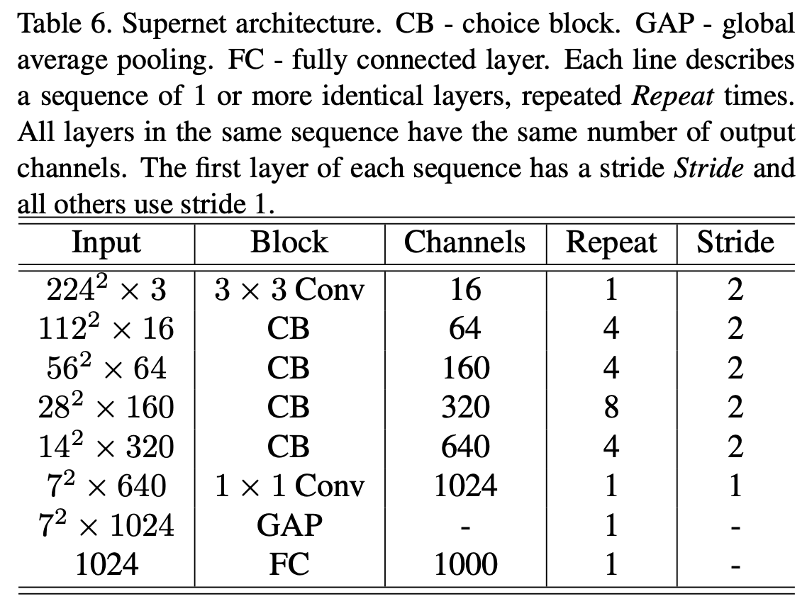
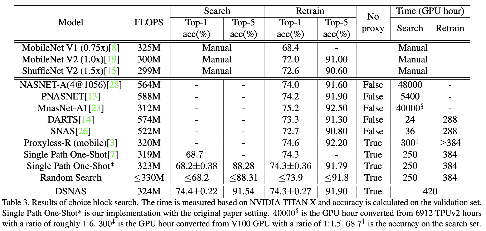

# DSNAS

This repository contains the PyTorch implementation of the paper **DSNAS: 
Direct Neural Architecture Search without Parameter Retraining**, CVPR 2020.

By Shoukang Hu*, Sirui Xie*, Hehui Zheng, Chunxiao Liu, Jianping Shi, Xunying Liu, Dahua Lin.

[Paper-arxiv](https://arxiv.org/abs/2002.09128)

## Supernet Architecture
<p align="center">
    
</p>

## Results
<p align="center">
    
</p>

## Getting Started
* Install [PyTorch](http://pytorch.org/)
* Clone the repo:
  ```
  git clone https://github.com/SNAS-Series/SNAS-Series.git
  ```

## Requirements
* python packages
  * pytorch>=0.4.0
  * torchvision>=0.2.1
  * tensorboardX
  
* some codes are borrowed from **Single Path One-Shot NAS** ([https://github.com/megvii-model/ShuffleNet-Series/tree/master/OneShot], one baseline in our paper) and **Sparse Switchable Normalization** [https://github.com/switchablenorms/Sparse_SwitchNorm]

### Data Preparation
- Download the ImageNet dataset and put them into the `{repo_root}/data/imagenet`

### Usage
Search:
```shell
python -m torch.distributed.launch --nproc_per_node=8 train_imagenet.py \
--SinglePath --bn_affine --flops_loss --flops_loss_coef 1e-6 --seed 48 --gen_max_child --early_fix_arch --config configs/SinglePath240epoch_arch_lr_1e-3_decay_0.yaml \
--remark 'search_arch_lr_1e-3_decay_0' &
```
After searching the Supernet with the early-stop strategy for {num} (default value: 80) peochs, we continue the searching stage with the following command: 
```shell
python -m torch.distributed.launch --nproc_per_node=8 train_imagenet_child.py \
--SinglePath --bn_affine --reset_bn_stat --seed 48 --config configs/{config_name} \
--remark {remark_name} &
```
Note that you need to add your current model path into the checkpoint_path of {config_name} (refer to configs/DSNAS_search_from_search_20191029_135429_80epoch.yaml)

Retrain:
```shell
python -m torch.distributed.launch --nproc_per_node=8 train_imagenet_child.py \
--SinglePath --retrain --bn_affine --reset_bn_stat --seed 48 --config configs/{config_name} \
--remark {remark_name} &
```
Note that you need to add your current model path into the checkpoint_path of {config_name} (refer to configs/DSNAS_retrain_from_search_20191029_135429_80epoch.yaml)

Tensorboard visualization: 
```shell
tensorboard --logdir=runs/ --port={port_num}
```
Note that all the experiments above will save the tensorboard log file in runs/ directory

### Trained models
| Model | Top-1<sup>*</sup> | Top-5<sup>*</sup> | Download | MD5 |  
| :----:  | :--: | :--:  | :--:  | :--:  |  
|DSNASsearch240 | 74.4% | 91.54% |[[Google Drive]](https://drive.google.com/open?id=1gfTgqgmHjpsJmB3Nq248FCuXXhIFaUou)  [[Baidu Pan (pin:f5c6)]](https://pan.baidu.com/s/1RIYQ1GTbs9KmvDwgL__mcQ)|c10b463274a0eac5a5ee47418ff15d34|  
|DSNASretrain240 | 74.3% | 91.90% |[[Google Drive]](https://drive.google.com/open?id=1DlByBmUhaqzyKC_10MFxfTKbyFnYr6rX)  [[Baidu Pan (pin:6grj)]](https://pan.baidu.com/s/1NOK4jQNjJxUXSlmv4w4MzA)|459098b27704524927fbd8ed34570103|  
|SPOSretrain240  | 74.3% | 91.78% |[[Google Drive]](https://drive.google.com/open?id=1nBdQf6G0l-NXTKWa0jjezY1hlsSA61lR)  [[Baidu Pan (pin:cj97)]](https://pan.baidu.com/s/1hemPkcvFwRtQCO5oM0m-YQ)|3350e439c1f75cbf61c4664c21d821c4|  

Evaluation:
```shell
python -m torch.distributed.launch --nproc_per_node=8 eval_imagenet.py \
--SinglePath --config configs/{config_name} --remark {remark_name} &
```
where {config_name} could be DSNASsearch240.yaml, DSNASretrain240.yaml, SPOSretrain240.yaml

### Citation
If you find our codes or trined models useful in your research, please consider to star our repo and cite our paper:

    @article{hu2020dsnas,
      title={DSNAS: Direct Neural Architecture Search without Parameter Retraining},
      author={Hu, Shoukang and Xie, Sirui and Zheng, Hehui and Liu, Chunxiao and Shi, Jianping and Liu, Xunying and Lin, Dahua},
      journal={arXiv preprint arXiv:2002.09128},
      year={2020}
    }
