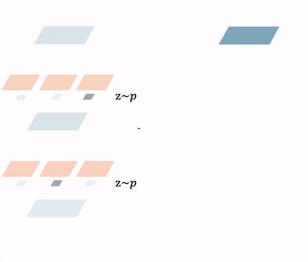

# SNAS-Series

This contains the PyTorch implementation of the SNAS-Series papers, including

**SNAS: 
Stochastic Neural Architecture Search**, ICLR 2019.

By Sirui Xie, Hehui Zheng, Chunxiao Liu, Liang Lin.

[Paper-arxiv](https://arxiv.org/abs/1812.09926)

Figure: Visualization for forward pass and gradient back-propagation within SNAS.

**DSNAS: 
Direct Neural Architecture Search without Parameter Retraining**, CVPR 2020.

By Shoukang Hu*, Sirui Xie*, Hehui Zheng, Chunxiao Liu, Jianping Shi, Xunying Liu, Dahua Lin.

[Paper-arxiv](https://arxiv.org/abs/2002.09128)

Figure: Visualization for forward pass and gradient back-propagation within DSNAS.

