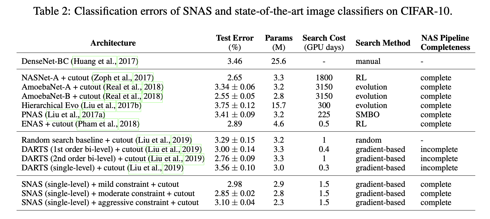

# SNAS

This repository contains the PyTorch implementation of the paper **SNAS: 
stochastic neural architecture search**, ICLR 2019.

By Xie Sirui, Zheng Hehui, Liu Chunxiao, Lin Liang.

[Paper-arxiv](https://arxiv.org/abs/1812.09926)

## Results
<p align="center">
    
</p>

## Requirements
```
Python >= 3.5.5, PyTorch == 0.4, torchvision == 0.2.0
```

## Datasets

CIFAR-10 can be automatically downloaded by torchvision, ImageNet needs to be downloaded manually.

## Architecture Search
Single GPU setup to search the architecture with 8 cells:
```
python train_search.py --snas --epochs 150 --seed 6 --layer 8 --init_channels 16 --temp 1 \
--temp_min 0.03 --nsample 1 --temp_annealing --resource_efficient \
--resource_lambda 1e-2 --log_penalty --drop_path_prob 3e-1 --method 'reparametrization' \
--loss --remark "snas_order_layer_8_batch_64_drop_0.3_error_lnR_1e-2_reparam_gpu_1" &
```
Multi GPU setup to search the architecture with 20 cells:
```
python -m torch.distributed.launch --nproc_per_node=8 train_search.py --snas --epochs 150 --seed 6 --layer 20 --init_channels 36 --batch_size 72  --temp 1 --temp_min 0.03 \
--nsample 1 --distributed --temp_annealing --resource_efficient --resource_lambda 1.5e-3 --log_penalty \
--drop_path_prob 2e-1 --method 'reparametrization'  --loss --remark "snas_order_layer_20_batch_14_drop_0.1_error_lnR_1.5e-3_reparam_gpu_8" &

python -m torch.distributed.launch --nproc_per_node=8 train_search.py --snas --epochs 150 --seed 6 --layer 20 --init_channels 36 --batch_size 112 --temp 1 --temp_min 0.03 \
--nsample 1 --distributed --temp_annealing --resource_efficient --resource_lambda 1.5e-3 --log_penalty --drop_path_prob 2e-1 \
--method 'discrete'  --loss --remark "snas_order_layer_20_batch_14_drop_0.1_error_lnR_1.5e-3_discrete_gpu_8" &
```
Note that we formulate the resource constraint with three methods, i.e., reparametrization, discrete and policy gradient.

## Architecture evaluation (using full-sized models)
```
python train.py --auxiliary --cutout --arch {arch}   # CIFAR-10 (DARTS-like architecture)

python train_edge_all.py --auxiliary --cutout --arch {arch_edge_all}  # CIFAR-10 (all-edge)

python train_imagenet.py --auxiliary --arch {arch}    # ImageNet
```
Note that {arch}, {arch_edge_all} could be SNAS_mild, SNAS_mild_edge_all in genotypes.py. 

Tensorboard visualization:
```
tensorboard --logdir=runs/ --port={port_num}
```
Note that all the experiments above will save the tensorboard log file in runs/ directory

### Trained models
| Model | Top-1 | Download | MD5 |  
| :----:  | :--: | :--:  | :--: |  
|cifar-10 mild constraint | 97.02% | [[Google Drive]](https://drive.google.com/open?id=1tjy4Nx7rSv6gc8efQcJAaEbDcdawT-6c)  [[Baidu Pan (pin:an86)]](https://pan.baidu.com/s/10ATRhFuB1bxysLfCYUhl_Q)|aebc72d18b2c79925fafcebcd68ec745|    

## Citation
If you find our codes or trined models useful in your research, please consider to star our repo and cite our paper:

    @article{xie2018snas,
      title={SNAS: stochastic neural architecture search},
      author={Xie, Sirui and Zheng, Hehui and Liu, Chunxiao and Lin, Liang},
      journal={arXiv preprint arXiv:1812.09926},
      year={2018}
    }
